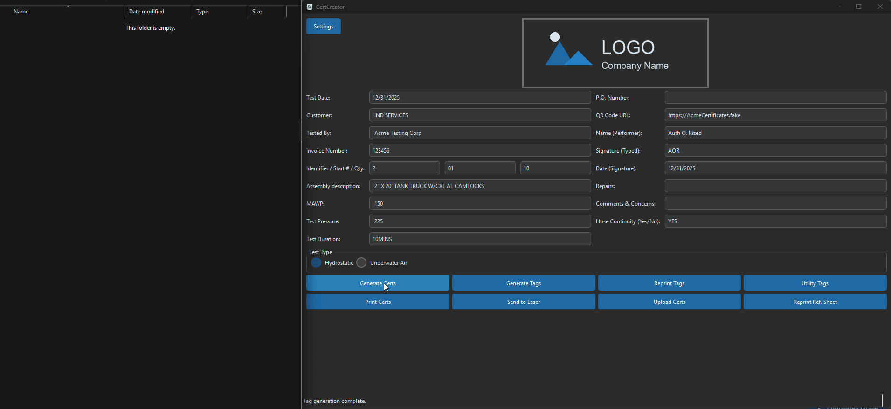

# CertCreator


> **Industrial Hardware Automation for Compliance Documentation.**

---

## 📸 Demo



---

## 💼 The Challenge

Our manufacturing process required generating safety certificates and simultaneously printing durable metal tags for industrial equipment. The bottleneck was software: the laser engraver required a specific propriety stream, while the certificates needed to be PDF. Doing this manually took 15 minutes per item.

## 🛠️ The Solution

I built *CertCreator*, a hardware-integrated automation tool. It acts as a bridge between the digital data (order specs) and the physical hardware (Epilog Laser Engraver).

* **Hardware Comms:** The application generates SVG vector graphics programmatically, converts them to a printer-specific `.prn` format, and streams them directly to the laser cutter's IP address.
* **Dynamic SVG Generation:** Instead of static templates, the app calculates font sizes and positions on the fly using Python's XML libraries, ensuring that long serial numbers automatically scale down to fit the physical tag.

---

## 🚀 Technical Highlights (The "Secret Sauce")

**Threaded Hardware I/O**
Sending data to industrial hardware can be slow and unpredictable. I implemented a `QThreadPool` architecture to handle the network communication. The `AppController` spins up a worker thread to handshake with the printer and stream the data. This prevents the "Not Responding" ghosting effect on Windows and allows the operator to queue up the next job while the laser is still firing.

### Key Code Snippet

```python
# Hardware Communication Thread
def _generate_and_run_epilog(self, progress_callback, instance, tag_data):
    """
    Runs the multi-step printing process in a background thread
    to prevent UI freezing during TCP/IP communication.
    """
    # 1. Generate SVG
    output_svg_path = self._svg_generator.generate_svg(tag_data)

    # 2. Convert to PRN (Driver level)
    prn_file_path = self._convert_svg_to_prn(output_svg_path)

    # 3. Stream to Hardware
    if not self._send_prn_to_laser(prn_file_path):
        self.logger.error("Failed to send PRN file to laser.")
```

---

## 🏗️ Architecture & Tech Stack

This application was built to be scalable and maintainable using the following technologies:

| Category | Technologies |
|----------|-------------|
| **Core** | Python, PySide6 |
| **Hardware Protocol** | TCP/IP (Socket communication), PRN file generation |
| **Vector Graphics** | LXML (SVG manipulation) |
| **Document Gen** | ReportLab (PDF Certificates) |

### Hardware Control Flow


---

## 🔐 Licensing & Access

This software is a proprietary custom solution developed for industrial automation.

**Availability:**
* **Source Code:** Closed Source (Private Repository)
* **Deployment:** Custom Hardware Integration

I specialize in building bridges between software and industrial hardware. If you have a manufacturing bottleneck that needs automation, contact me to discuss a custom solution.

---

## 📬 Contact

**Aaron** *Operations Manager turned Python Developer* Looking to automate your business operations?  
[View Portfolio Website](https://bearded1derer.github.io/) | [Connect on LinkedIn](https://www.linkedin.com/in/aaron-arpin-979a1354/)
